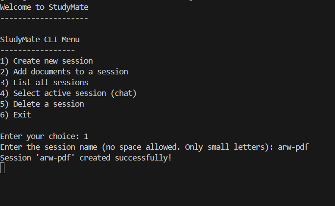
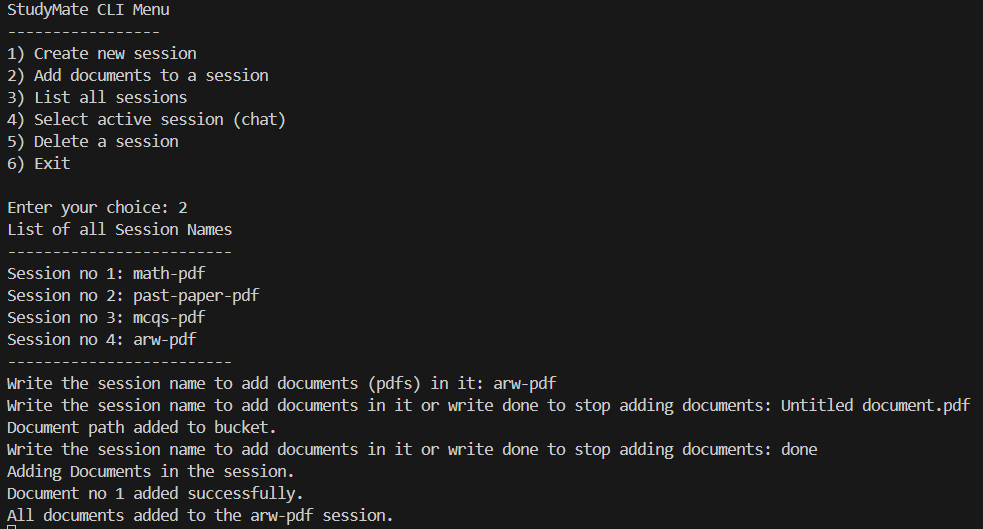
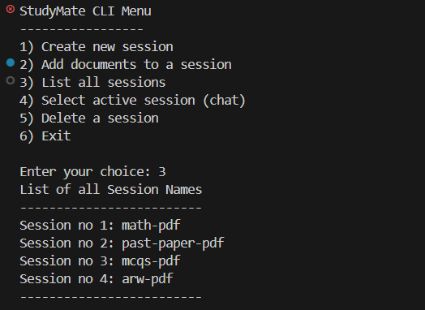
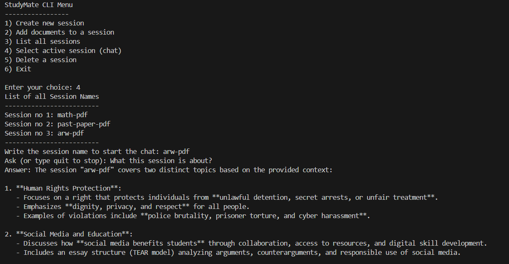
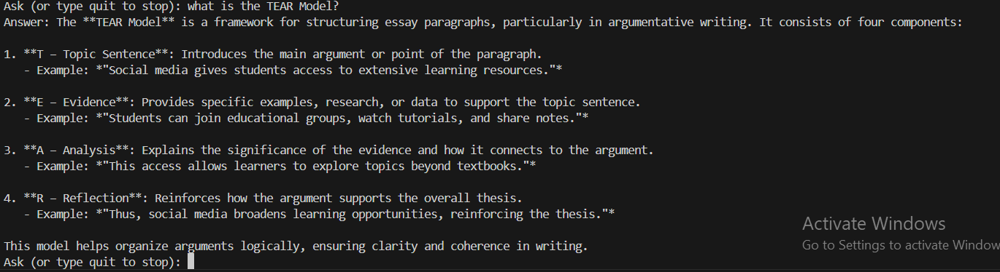
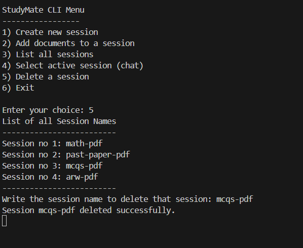

# StudyMate CLI

#### StudyMate CLI is a command-line educational assistant that answers questions strictly from your PDFs. It uses ChromaDB, HuggingFace embeddings, and Groq LLM for accurate, context-aware answers.

## Features
##### - Create multiple study sessions.

##### - Add PDFs to sessions; documents are split into searchable chunks.

##### - Ask questions and get answers strictly from uploaded documents.

##### - List and delete sessions.

## 
## Project Structure
```markdown
StudyMate CLI/
├─ src/                 # Source code
│  ├─ main.py           # CLI entry point
│  ├─ classes.py        # Vector DB & RAGAssistant
│  └─ functions.py      # CLI functions (create session, add docs, chat, delete)
├─ pdfs/                # Place your PDF files here
├─ assets/              # Screenshots for README
├─ environment/         # Virtual environment
└─ sessions.txt         # Stores created session names
```

## Setup Instructions

### Clone the repo:
```
git clone https://github.com/m-noumanfazil/StudyMate-CLI.git
cd StudyMate-CLI
```

### Create and activate a virtual environment:
```
python -m venv environment
# Windows
.\environment\Scripts\activate
# Linux/Mac
source environment/bin/activate
```

### Install dependencies:
```
pip install -r requirements.txt
```

Add a .env file in the root with:
```
GROQ_API_KEY=your_groq_api_key
EMBEDDING_MODEL=all-MiniLM-L6-v2
```

## Usage
### 1) Run the program
```
py main.py
```

### 2) Create a Session
Choose "Create new session" and enter a unique name for your study topic.



### 3) Add PDFs to a Session
Select "Add documents to a session", pick the session you created, and add your PDFs. Use relative paths like pdfs/yourfile.pdf or absolute paths.



### 4) List Sessions
Use "List all sessions" to see the sessions you’ve created.



### 5) Start Chatting with StudyMate
Choose "Select active session (chat)", pick a session, and ask questions. StudyMate will answer based strictly on the PDFs you added.





### 6) Delete a Session (Optional)
Use "Delete a session" to permanently remove a session and its documents from memory.



## License

MIT License

## Notes

- PDFs must exist at the path you provide.

- Currently CLI-only; GUI version may come in future updates.

## Future Improvements

- Auto-detect PDFs in a folder for easier document selection.

- Streamlit or GUI version for a graphical interface.

- Multi-user support for multiple independent sessions.

- Context caching for faster repeated queries.
